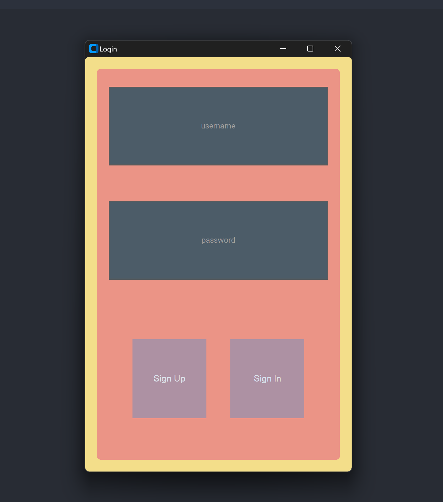

# LoginUI

LoginUI is a simple login page made with Python allowing users to log in with a username and a password.

## Features
- Login with a username and a password
- Register a new user easily
- Method present to check if a user is already registered
- Hashing method (applied to the password) to ensure security
- Useful messagebox to inform the user of the result of the login/register attempt

## Installation

